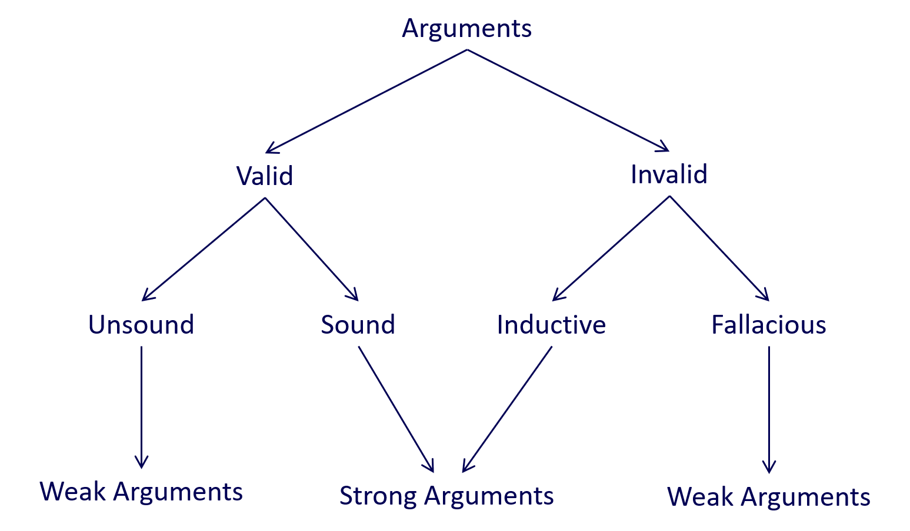

# Advanced Professional Development
## Contents

* [**Week 1** Critical analysis and logical thinking techniques](#1)
	* [Definition of critical thinking](#1.1)
	
	* [Arguments and premises](#1.2)
		* [Critical Reasoning](#1.2.1)
		* [Valid vs invalid arguments](#1.2.2)
		* [Sound vs unsound arguments](#1.2.3)
		* [Inductive vs fallacious arguments](#1.2.4)
		* [What makes an argument strong or weak?](#1.2.5)
	
	* [Evaluating Arguments](#1.3)
		* [A seven-step strategy](#1.3.1)
		* [Common fallacies](#1.3.2)
* [**Week 2** Cyberethics, ethical concepts and theories](#2)

  * [The differences between ethics and cyberethics](#2.1) 

    * [Ethics and ethical reasoning](#2.1.1)
    * [Cyberethics](#2.1.2)
    * [The Australian Computer Society Code of Professional Conduct](#2.1.3)
    * [Why should IT professionals bother with ethical issues?](#2.1.4)

  * [Ethical theories and historical view of ethics](#2.2)
    * ww
  * sss
* [**Week 3**](#3)

***
<h2 id="1"> Week 1 Critical analysis and logical thinking techniques</h2>
<h3 id="1.1"> 1. Definition of critical thinking</h3>

**A mode of thinking where the thinker improves the quality of his or her thinking by skilfully taking charge of the structures inherent in thinking and imposing intellectual standards upon them.**

self-directed (i.e. determined to form excellent thoughts)<br>
self-disciplined (i.e. disciplined to apply the system)<br>
self-monitored (i.e. continuous observation and examination of one’s own thoughts)<br>
self-corrective (i.e. corrective feedback as the result of one’s own analysis)<br>

<h3 id="1.2"> 2. Arguments and premises</h3>
<h4 id="1.2.1"> 2.1 Critical Reasoning</h4>

Critical reasoning makes use of the strategies involved in critical thinking to analyse and evaluate arguments. Critical reasoning, like critical thinking, is a core skill for academic enquiry in general, as it allows an individual to evaluate an argument based on the available evidence, compare and contrast the argument with other arguments available, and make an informed judgement about the argument’s strengths and weaknesses.<br>

__An argument is a collection of claims (a.k.a. statements or assertions). Some of which are reasons (i.e. the premises) for another (i.e. the conclusion).__<br>
__Premises of an argument are its statements of evidence giving reasons to believe the conclusion is true.__

```
Argument structure

 PREMISE 1

 PREMISE 2 (optional)

 PREMISE 3 (optional)

 ...

 PREMISE n (optional)

 CONCLUSION
```
```
> Claims

A claim asserts something that could be either TRUE or FALSE.

A claim can be either Descriptive or Normative.

> Descriptive claims:

Assert that something IS or COULD BE the case
Do not make value judgements or express opinions
Are based on empirical evidence e.g. “this class has 2000 seats”
 
> Examples of descriptive claims:

This slide has 200 words on it.
My coffee is now at room temperature.
Alice is 36 years old.
The population of Melbourne is 4M people.
 
> Normative claims:

Assert that something OUGHT TO BE the case
Make evaluation or judgement
Are relative to standard, ideal, or alternative e.g. “this class is large”
 
> Examples of normative claims:

200 words on a slide is too much!
My coffee got cold.
Alice is still young.
To pass this test, you should work harder.
```
**Note: Ethical claims are all Normative.**

When assessing arguments, we must not only pay attention to what is explicitly stated but also what is implied. Arguments can contain unstated assumptions, which may or may not be true. In order to assess them, we must first identify and state them as clear premises.

```
Example 1:

I saw him leaving that building. He must know the owner.
```
Note that this argument has a missing premise that is assumed. It is assuming that anyone leaving that building must know the owner.

```
Example 2:

I kept going to gym every day because I planned to lose weight. 
I haven’t lost any weight since I started going. 
I don’t think going to gym has any impact on losing weight.
```
Note the unstated assumptions in this argument. The author is assuming that “going to gym” is all that is needed for losing weight and nothing else interferes. So, if we rewrite the argument with all its premises, it will look like the following:

```
I kept going to gym every day because I planned to lose weight.
Simply going to gym is all that is necessary to lose weight. 
I haven’t lost any weight since I started going. 
I don’t think going to gym has any impact on losing weight.
```
When the unwritten premise becomes explicit, you might witness flaws in the logic and structure of an argument as you can see above.

<h4 id="1.2.2"> 2.2 Valid vs invalid arguments</h4>

**A valid argument is valid by virtue of its logical form, not its content.**

```
An example of a valid logical form:

Premise 1: Every A is a B.

Premise 2: C is an A.

Conclusion: C is a B.

This argument is valid because it is logical.
```

> **Testing an argument for validity:**
>
> Assume that the premises are TRUE<br>
Is it possible for the conclusion to be FALSE?<br>
> No? The argument is VALID.<br>
> Yes? The argument is INVALID.
> 
> * **Invalid argument**
> > PREMISE (assumed TRUE)<br>
> > CONCLUSION (might be false)
> 
> * **Valid argument**
> > PREMISE (assumed TRUE)<br>
> > CONCLUSION (impossible to be false)


<h4 id="1.2.3"> 2.3 Sound vs unsound arguments</h4>

**A sound argument is both valid (i.e. the assumed truth of the premises would guarantee the truth of the argument’s conclusion); and its premises are true in the actual world.**

An argument is considered sound when it passes the first test of validity (i.e., it is valid) and its premises can be proven to be true in the real world (i.e., not just assumed to be true).

Sound arguments are not common, and where they do exist, they are likely to be trivial and not particularly informative or interesting.

<h4 id="1.2.4"> 2.4 Inductive vs fallacious arguments</h4>

> Not all invalid arguments are weak arguments.
> 
> * **An inductive argument, for example, is an invalid argument which, while it does not guarantee its conclusion contains a high degree of probability, its conclusion is correct.** <br>In other words, an inductive argument is an argument in which the conclusion likely follows from assuming the truth of the premises.
>
> * **A fallacious argument is the inverse of an inductive argument. It is an invalid argument which does not guarantee its conclusion and contains a low degree of probability that its conclusion is correct.**<br> In other words, an argument in which the conclusion does not likely follow from assuming the truth of the premises.

<h4 id="1.2.5"> 2.5 What makes an argument strong or weak?</h4>



<h3 id="1.3"> 3. Evaluating Arguments</h3>
<h4 id="1.3.1"> 3.1 A seven-step strategy</h4>

Scenario: Reasoning about whether to download software from “Sharester”

> You are contemplating downloading a software application that is available on a Web site called Sharester, a file‐sharing P2P (peer‐to‐peer) site. Sharester is not officially designated as a “pirate site” because it mainly provides users with access to (freely available) open‐source software applications. However, this site also contains a few proprietary (or copyrighted) software applications that users can download. It turns out that the particular application you are interested in downloading is proprietary; furthermore, there is no indication that the copyright holder has authorized the free downloading of that application. Although you wish to download this application for personal use (only), you are conflicted about what to do; so you discuss your concerns with a close friend, Charlie.
>
> Charlie tries to convince you not to download a proprietary software program using the following rationale: Downloading proprietary software (without permission from the copyright holder) is identical to stealing physical property. Stealing physical property is morally wrong. Therefore, downloading proprietary software (without permission) is morally wrong.
>
> (Reproduced from Tavani, Herman T. 2015, *Ethics and Technology: Controversies, Questions and Strategies for Ethical Computing*, 5th edn, Wiley.)

**Apply seven-step strategy:**

> **Step 1:** Convert the argument into standard form. List the premises and the conclusion.
>
> > In this scenario, the premises and the conclusion are already presented.
> > 
> > Premise 1: Downloading proprietary software (without permission from the copyright holder) is identical to stealing physical property.
> >
> > Premise 2: Stealing physical property is morally wrong.
> > 
> > Conclusion: Downloading propriety software (without permission) is morally wrong.
>
> **Step 2:** Test the argument for its strength of reasoning to see whether it is valid or invalid.
> > **If we assume that both premises are true, can the conclusion be false?**<br>
> > If we assume the truth of both its premises, the conclusion cannot be false.
>
> **Step 3:** Is the argument valid?
> > If yes, go to Step 4.<br>
> > If no, go to Step 5.
>
> **Step 4:** Is the valid argument also sound?
> > **The above argument is valid.**<br>
> > “Are all of the premises true in the actual world?”<br>
> > If so then the argument is also sound.<br> 
> > If one or more premises can be shown to be false, then the argument is unsound.
>
> **Step 5:** Is the invalid argument inductive or fallacious?
> > **The above argument is invalid.**<br>
> > The above argument is valid so we can skip step 5 which only applies to invalid arguments.
>
> **Step 6:** Determine whether the premises in your argument are either true or false in the actual world.
> > * Premise 1<br>
> > The truth or falsity of Premise 1 is not so clear cut. Although there would certainly seem to be a strong analogy between stealing physical property and downloading unauthorised software, there are also some disanalogies. Thus, the two behaviours are not, strictly speaking at least, “identical”. So, Premise 1 may be either false or indeterminate (i.e., it is not literally true).
> > 
> > * Premise 2<br>
> > Premise 2 is a true statement (and is easily verifiable).
>
> **Step 7:** Make an overall assessment of the argument.
>
> > The argument is valid and unsound.

> * Scenario 1<br>
A major association representing the music industry in the United States has determined that 4,000 copies of a new album featuring a popular rock group, called DUO, had been illegally downloaded last month. The cost of this album for those who elect to download it legally from online music stores is $10 per copy. So, the association concludes that the music company that holds the copyright to this album lost $40,000 dollars in revenue last month (on that album alone).
>
> * Scenario 2<br>
You are engaged in an intense discussion with your friend, Bill, who works in the IT department at your university. Bill complains that many students are using P2P (peer‐to‐peer) file‐sharing applications on the university’s network to download excessive amounts of unauthorized copyrighted material. He also claims that the most effective solution to this problem would be to disable student access to all (existing) P2P sites and to prevent students at your institution from setting up their own P2P sites for any reason whatsoever (even to include noncopyrighted material). You convey to Bill your belief that this measure is too drastic. However, Bill argues that the only way to eliminate unauthorized file sharing among students at your institution is to disable access to all P2P software on the university’s network.
> 
> Tavani, Herman T. 2015, *Ethics and Technology: Controversies, Questions, and Strategies for Ethical Computing*, 5th edn, Wiley. 

<h4 id="1.3.2"> 3.2 Common fallacies</h4>

**Fallacy does not mean false statement.**<br>

* 13 common different types of fallacies:

> **Ad Hominem Argument** (Latin for 'to the person')<br>
>
> > Attack is directed at the person rather than the substance of what is disputed.
> > 
> > For example, Edward Snowden was not a whistle-blower, but rather a self-serving narcissist who was more interested in promoting himself than in exposing any wrongdoing. Also, he is reported to have lied both to his employer and his girlfriend. So, how could anyone possibly believe that Snowden’s leaking of the sensitive NSA documents was morally justified?
>
> **Slippery Slope Argument**
> > X could possibly be abused; therefore, we should not allow X.
> > 
> > For example, we should not continue to allow computer manufacturers to build computer systems that include CD burners. If we allow them to do so, young people will burn copies of copyrighted music illegally.
>
> **Fallacy of Appeal to Authority**
> > PREMISE 1: X is an authority in field Y.<br>
> > PREMISE 2: X said Z.<br>
> > CONCLUSION: Z.<br>
> > 
> > For example, Tim Berners-Lee believes that Twitter is superior to SNSs such as Facebook and LinkedIn. And Berners-Lee is clearly an expert on matters involving the web and the internet. So, Twitter must be superior to alternative SNSs such as Facebook and LinkedIn.
>
> **False Cause Fallacy**
> > PREMISE 1: Event X preceded event Y.<br>
> > CONCLUSION: Event X is necessarily the cause of event Y.
> >
> > For example, shortly after the release of the Microsoft Windows 10 operating system in 2015, Microsoft’s stock plummeted severely. Hence, there is no doubt that the release of Windows 8 is responsible for the decline in Microsoft’s loss in the stock market.
>
> **Fallacy of Composition**
> > This fallacy confuses the characteristics that apply to the parts of a whole, or to the individual members of a group, with the characteristics of the whole itself.
> >
> > For example, the new XYZ laptop computer is the best system on the market. XYZ has the fastest processor currently available on any laptop, it comes with twice the amount of RAM than any of its competitors, and it comes equipped with a suite of office applications that are superior to those on any currently available system. Also, its monitor has the best resolution and graphic display currently available on any commercial laptop.
>
> **Fallacy of Ambiguity**
> > This fallacy occurs whenever one or more terms in an argument are used ambiguously. Ambiguous terms have more than one meaning.
> >
> >For example, humans can think and highly sophisticated AI (artificial intelligence) computer systems can think; therefore, highly sophisticated AI computer systems are human.
>
> **The False Dichotomy**
> > This fallacy presents us with two options that might initially seem to be mutually exclusive, but in fact are not.
> >
> >EXAMPLE 1: If you are not with us, you are against us.<br>
> >EXAMPLE 2: Either you agree with firearms regulation or you hate America.<br>
> >EXAMPLE 3: If you don’t believe in God, you are an unethical person.
>
> **The Virtuality Fallacy**
> > PREMISE 1: X exists in cyberspace.<br>
> > PREMISE 2: Cyberspace is virtual.<br>
> > CONCLUSION: X (or the effect of X) is not real.
> > 
> > For example, launching viruses and engaging in unauthorised entries into computer systems exists in cyberspace and does not cause any real harm to people.
>
> **Non-Testable Hypothesis**
> > Something that is not proven false, must or is likely to be true. 
>
> **Band Wagon**
> > The popular ideas are necessarily right.
>
> **Red Herring**
> > Introducing a topic not related to the subject at hand in order to talk about a seemingly relevant, but in fact irrelevant, topic rather than the real or original issue.
>
> **Straw Man**
> > Misrepresenting the opponent’s position (e.g. by weakening it) and producing an argument against the misrepresentation.
>
> **Guilt by Association**
>
> > Two things share some properties, therefore they are the same.

---

<h2 id="2"> Week 2 Cyberethics, ethical concepts and theories</h2>
<h3 id="2.1"> 1. The differences between ethics and cyberethics</h3>

> * Printing someone else’s codes does not affect the person you copied from.
>
> * Stealing a car will definitely affect the person as they will no longer have a car to use. 
>
>   So, if the owner of the codes is not affected by your act of copying their codes, would you consider this action as stealing? 
>
> **“Ethics”** as we know it today was established over 100 years ago and can barely keep up with the world today. 
>
> The law protects physical property, but can it be applied in the same way to the world of computing? 
>
> **The challenges that IT professionals face right now is the lack of rules, regulations and ethical codes that apply to new technologies. IT professionals are left to apply what’s available to them to rationalise and analyse what is ethically right or wrong.**
>
> Due to the lack of clear rules and ethical codes, IT professionals often have to rely on their “gut” feeling. We obviously don’t want mobile phone companies to use their gut feeling about whether it’s right or wrong to trace our movements using geotracking installed on our phones. 
>
> This is why it is important that we come up with proper ways of navigating the ambiguous scenarios that happen in professional IT practice. 

<h4 id="2.1.1">1.1 Ethics and ethical reasoning</h4>

> What is ethics? 
>
> > Human behavior has consequences for the welfare of others
>
> Why do we need ethics? 
>
> Three modes of character integration 
>
> > The Uncritical Person
> >
> > The Self-Serving Critical Person
> >
> > The Fair-Minded Critical Person 
>
> What isn’t ethics? 
>
> > Social convention 
> >
> > Religious beliefs 
> >
> > Political ideology 
> >
> > The law 

<h4 id="2.1.2">1.2 Cyberethics</h4>

**Cyberethics examines the impact of cybertechnology on our social, legal and moral systems, and it evaluates the social policies and laws that have been framed in response to issues generated by its development and use.**

Cybertechnology refers to a wide range of computing and communication devices, from stand-alone personal computers (PCs) to connected, or networked, computing and communication technologies. Cybertechnology includes, but is not limited to, smart phones, music players (e.g. iPods), tablets, laptops, desktops, large mainframe computers, etc. 

These devices can be standalone or connected via a network. The networks in turn can be private (e.g. LAN, WAN) or public (e.g. the internet). The internet and privately owned computer networks are perhaps the most common and well-known examples of cybertechnology.

<h4 id="2.1.3">1.3 The Australian Computer Society Code of Professional Conduct</h4>

The Australian Computer Society (ACS) is the largest professional body in Australia representing the ICT sector. More than 42,000 ACS members work in business, education, government and the community. The ACS exists to create the environment and provide the opportunities for members and partners to succeed. The ACS strives for ICT professionals to be recognised as drivers of innovation in our society, relevant across all sectors, and to promote the formulation of effective policies on ICT and related matters. 

> **ACS Code of Ethics** 
>
> The ACS Code of Ethics is part of the ACS Constitution. As an ACS member, you must uphold and advance the honour, dignity and effectiveness of being a professional. This entails, in addition to being a good citizen and acting within the law, your adherence to the following Society values: 
>
> 1. The Primacy of the Public Interest 
>    You will place the interests of the public above those of personal, business or sectional interests. 
>
>    > 1. identify those potentially impacted by your work and explicitly consider their interests;
>    >
>    > 2. raise with stakeholders any potential conflicts between your professional activity and
>    >
>    > legal or other accepted public requirements;
>    >
>    > 3. advise your stakeholders as soon as possible of any conflicts of interest or conscientious objections that you have;
>    >
>    > 4. take into consideration the fact that your profession traverses many other professions, and has implications for other social systems and organisations;
>    > 5. endeavour to preserve the integrity, security, continuity and utility of ICT;
>    > 6. respect the intellectual property of others; and
>    > 7. endeavour to preserve the confidentiality and privacy of the information of others.
>
> 2. The Enhancement of Quality of Life 
>    You will be honest in your representation of skills, knowledge, services and products. 
>
>    > 1. recognise, in your work, the role that ICT can play to enhance the quality of life of people, particularly the disadvantaged or those with disabilities;
>    >
>    > 2. protect and promote the health and safety of those affected by your work;
>    >
>    > 3. understand, and give due regard to, the perceptions of those affected by your work; and
>    >
>    > 4. attempt to increase the feelings of personal satisfaction, competence, and control of
>    >
>    >    those affected by your work.
>
> 3. Honesty 
>    You will be honest in your representation of skills, knowledge, services and products. 
>
>    > 1. reject, and will not make, any offer of bribery or inducement;
>    > 2. not knowingly mislead a client or potential client as to the suitability of a product or service;
>    > 3. distinguish between your professional and personal opinions and advice;
>    > 4. give realistic estimates for projects under your control;
>    > 5. qualify professional opinions which you know are based on limited knowledge or experience;
>    > 6. give credit for work done by others where credit is due; and
>    > 7. not attempt to enhance your own reputation at the expense of another person’s reputation.
>
> 4. Competence 
>    You will work competently and diligently for your stakeholders. 
>
>    > 1. endeavour to provide products and services which match the operational and financial needs of your stakeholders;
>    > 2. not misrepresent your skills or knowledge;
>    > 3. make yourself aware of relevant standards and legislation, and act accordingly;
>    > 4. respect and protect your stakeholders' proprietary interests;
>    > 5. advise your stakeholders when you believe a proposed project, product or service is not in their best interest;
>    > 6. accept responsibility for your work; and
>    > 7. respect, and seek when necessary, the professional expertise of colleagues in their areas of competence.
>
> 5. Professional Development 
>    You will enhance your own professional development, and that of your colleagues and staff. 
>
>    > 1. continue to upgrade your knowledge and skills;
>    > 2. increase your awareness of issues affecting the profession and its relationship with the public;
>    > 3. encourage your colleagues, employees and students to continue their own professional development; and
>    > 4. support education, training and professional development in ICT that reflects the diverse needs of individual professionals and their various career paths.
>
> 6. Professionalism 
>    You will enhance the integrity of the Society and the respect of its members for each other.
>
>    > 1. take a calm, objective, informed and knowledgeable stance on your professional work, complementing your enthusiasm and engagement in it;
>    > 2. take appropriate action against members who engage in behaviours contrary to this Code;
>    > 3. confront attempts to limit diversity in the workplace, and ensure that opportunities for employment, advancement, remuneration and other working conditions are based on the actual skills and performance of employees, free of stereotypes and prejudices;
>    > 4. note that the corporate actions of the Society are subject to this Code, and you should do whatever you can to ensure that the ACS and its officers meet this obligation;
>    > 5. neither require, nor attempt to influence, any person to take any action which would involve a breach of this Code;
>    > 6. refrain from any conduct or action in your professional role which may tarnish the image of the profession or detract from the good name of the ACS;
>    > 7. endeavour to extend public knowledge and understanding of ICT;
>    > 8. co-operate in advancing ICT by communication with other professionals, students and the public; and
>    > 9. have pride in your profession, and protect and promote professionalism in ICT

<h4 id="2.1.4">1.4 Why should IT professionals bother with ethical issues?</h4>

[My first IT professional toolkit](./IT_professional_toolkit.md)

<h3 id="2.2">2 Ethical theories and historical view of ethics</h3>

* Not every moral issue is a moral dilemma and not every dilemma is necessarily moral in nature.

* The term **dilemma** refers a situation where one is confronted with **having to make a choice between two options, both of which can entail an undersirable or unpleasant outcome.**

<h4 id="2.2.1"> 2.1 Ethics and morality</h4>

* Ethics is the study of morality.
* **Morality can be defined as a system of rules for guiding human conduct and principles for evaluating those rules.**

