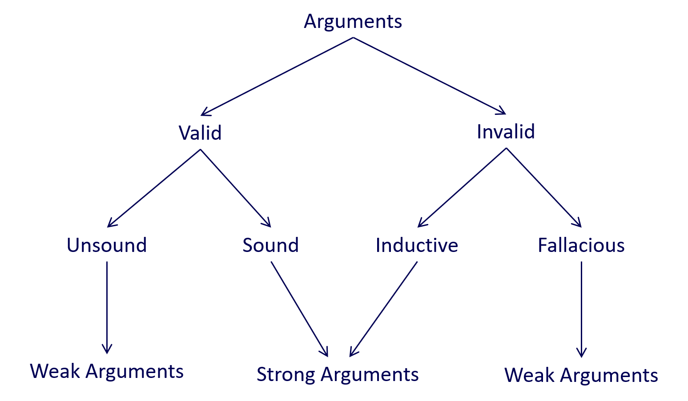

# Advanced Professional Development
Notebook

## Week 1 Critical analysis and logical thinking techniques
### 1. Definition of critical thinking
**A mode of thinking where the thinker improves the quality of his or her thinking by skilfully taking charge of the structures inherent in thinking and imposing intellectual standards upon them.**<br>

self-directed (i.e. determined to form excellent thoughts)<br>
self-disciplined (i.e. disciplined to apply the system)<br>
self-monitored (i.e. continuous observation and examination of one’s own thoughts)<br>
self-corrective (i.e. corrective feedback as the result of one’s own analysis)<br>

### 2. Arguments and premises
#### 2.1 Critical Reasoning
Critical reasoning makes use of the strategies involved in critical thinking to analyse and evaluate arguments. Critical reasoning, like critical thinking, is a core skill for academic enquiry in general, as it allows an individual to evaluate an argument based on the available evidence, compare and contrast the argument with other arguments available, and make an informed judgement about the argument’s strengths and weaknesses.

__An argument is a collection of claims (a.k.a. statements or assertions). Some of which are reasons (i.e. the premises) for another (i.e. the conclusion).__<br>
__Premises of an argument are its statements of evidence giving reasons to believe the conclusion is true.__

```
Argument structure

 PREMISE 1

 PREMISE 2 (optional)

 PREMISE 3 (optional)

 ...

 PREMISE n (optional)

 CONCLUSION
```
```
> Claims

A claim asserts something that could be either TRUE or FALSE.

A claim can be either Descriptive or Normative.

> Descriptive claims:

Assert that something IS or COULD BE the case
Do not make value judgements or express opinions
Are based on empirical evidence e.g. “this class has 2000 seats”
 
> Examples of descriptive claims:

This slide has 200 words on it.
My coffee is now at room temperature.
Alice is 36 years old.
The population of Melbourne is 4M people.
 
> Normative claims:

Assert that something OUGHT TO BE the case
Make evaluation or judgement
Are relative to standard, ideal, or alternative e.g. “this class is large”
 
> Examples of normative claims:

200 words on a slide is too much!
My coffee got cold.
Alice is still young.
To pass this test, you should work harder.
```
**Note: Ethical claims are all Normative.**

When assessing arguments, we must not only pay attention to what is explicitly stated but also what is implied. Arguments can contain unstated assumptions, which may or may not be true. In order to assess them, we must first identify and state them as clear premises.

```
Example 1:

I saw him leaving that building. He must know the owner.
```
Note that this argument has a missing premise that is assumed. It is assuming that anyone leaving that building must know the owner.

```
Example 2:

I kept going to gym every day because I planned to lose weight. 
I haven’t lost any weight since I started going. 
I don’t think going to gym has any impact on losing weight.
```
Note the unstated assumptions in this argument. The author is assuming that “going to gym” is all that is needed for losing weight and nothing else interferes. So, if we rewrite the argument with all its premises, it will look like the following:

```
I kept going to gym every day because I planned to lose weight.
Simply going to gym is all that is necessary to lose weight. 
I haven’t lost any weight since I started going. 
I don’t think going to gym has any impact on losing weight.
```
When the unwritten premise becomes explicit, you might witness flaws in the logic and structure of an argument as you can see above.

#### 2.2 Valid vs invalid arguments
**A valid argument is valid by virtue of its logical form, not its content.**

```
An example of a valid logical form:

Premise 1: Every A is a B.

Premise 2: C is an A.

Conclusion: C is a B.

This argument is valid because it is logical.
```

> **Testing an argument for validity:**
>
> Assume that the premises are TRUE<br>
Is it possible for the conclusion to be FALSE?<br>
> No? The argument is VALID.<br>
> Yes? The argument is INVALID.
> 
> * **Invalid argument**
> > PREMISE (assumed TRUE)<br>
> > CONCLUSION (might be false)
> 
> * **Valid argument**
> > PREMISE (assumed TRUE)<br>
> > CONCLUSION (impossible to be false)


#### 2.3 Sound vs unsound arguments
**A sound argument is both valid (i.e. the assumed truth of the premises would guarantee the truth of the argument’s conclusion); and its premises are true in the actual world.**

An argument is considered sound when it passes the first test of validity (i.e., it is valid) and its premises can be proven to be true in the real world (i.e., not just assumed to be true).

Sound arguments are not common, and where they do exist, they are likely to be trivial and not particularly informative or interesting.

#### 2.4 Inductive vs fallacious arguments
> Not all invalid arguments are weak arguments.
> 
> * **An inductive argument, for example, is an invalid argument which, while it does not guarantee its conclusion contains a high degree of probability, its conclusion is correct.** <br>In other words, an inductive argument is an argument in which the conclusion likely follows from assuming the truth of the premises.

> * **A fallacious argument is the inverse of an inductive argument. It is an invalid argument which does not guarantee its conclusion and contains a low degree of probability that its conclusion is correct.**<br> In other words, an argument in which the conclusion does not likely follow from assuming the truth of the premises.

#### 2.5 What makes an argument strong or weak?


### 3. Evaluating Arguments
#### 3.1 A seven-step strategy
Scenario: Reasoning about whether to download software from “Sharester”

> You are contemplating downloading a software application that is available on a Web site called Sharester, a file‐sharing P2P (peer‐to‐peer) site. Sharester is not officially designated as a “pirate site” because it mainly provides users with access to (freely available) open‐source software applications. However, this site also contains a few proprietary (or copyrighted) software applications that users can download. It turns out that the particular application you are interested in downloading is proprietary; furthermore, there is no indication that the copyright holder has authorized the free downloading of that application. Although you wish to download this application for personal use (only), you are conflicted about what to do; so you discuss your concerns with a close friend, Charlie.

> Charlie tries to convince you not to download a proprietary software program using the following rationale: Downloading proprietary software (without permission from the copyright holder) is identical to stealing physical property. Stealing physical property is morally wrong. Therefore, downloading proprietary software (without permission) is morally wrong.

> (Reproduced from Tavani, Herman T. 2015, *Ethics and Technology: Controversies, Questions and Strategies for Ethical Computing*, 5th edn, Wiley.)

<br>
**Apply seven-step strategy:**

> **Step 1:** Convert the argument into standard form. List the premises and the conclusion.
> 
> > In this scenario, the premises and the conclusion are already presented.
> > 
> > Premise 1: Downloading proprietary software (without permission from the copyright holder) is identical to stealing physical property.
> >
> > Premise 2: Stealing physical property is morally wrong.
> > 
> > Conclusion: Downloading propriety software (without permission) is morally wrong.
>
> **Step 2:** Test the argument for its strength of reasoning to see whether it is valid or invalid.
> > **If we assume that both premises are true, can the conclusion be false?**<br>
> > If we assume the truth of both its premises, the conclusion cannot be false.
>
> **Step 3:** Is the argument valid?
> > If yes, go to Step 4.

> > If no, go to Step 5.
> 
> **Step 4:** Is the valid argument also sound?
> > **The above argument is valid.**<br>
> > “Are all of the premises true in the actual world?”<br>
> > If so then the argument is also sound.<br> 
> > If one or more premises can be shown to be false, then the argument is unsound.
>
> **Step 5:** Is the invalid argument inductive or fallacious?
> > **The above argument is invalid.**<br>
> > The above argument is valid so we can skip step 5 which only applies to invalid arguments.
>  
> **Step 6:** Determine whether the premises in your argument are either true or false in the actual world.
> > * Premise 1<br>
> > The truth or falsity of Premise 1 is not so clear cut. Although there would certainly seem to be a strong analogy between stealing physical property and downloading unauthorised software, there are also some disanalogies. Thus, the two behaviours are not, strictly speaking at least, “identical”. So, Premise 1 may be either false or indeterminate (i.e., it is not literally true).
> > 
> > * Premise 2<br>
> > Premise 2 is a true statement (and is easily verifiable).
>
> **Step 7:** Make an overall assessment of the argument.
> > The argument is valid and unsound.

<br>
> * Scenario 1<br>
A major association representing the music industry in the United States has determined that 4,000 copies of a new album featuring a popular rock group, called DUO, had been illegally downloaded last month. The cost of this album for those who elect to download it legally from online music stores is $10 per copy. So, the association concludes that the music company that holds the copyright to this album lost $40,000 dollars in revenue last month (on that album alone).

> * Scenario 2<br>
You are engaged in an intense discussion with your friend, Bill, who works in the IT department at your university. Bill complains that many students are using P2P (peer‐to‐peer) file‐sharing applications on the university’s network to download excessive amounts of unauthorized copyrighted material. He also claims that the most effective solution to this problem would be to disable student access to all (existing) P2P sites and to prevent students at your institution from setting up their own P2P sites for any reason whatsoever (even to include noncopyrighted material). You convey to Bill your belief that this measure is too drastic. However, Bill argues that the only way to eliminate unauthorized file sharing among students at your institution is to disable access to all P2P software on the university’s network.

>Tavani, Herman T. 2015, *Ethics and Technology: Controversies, Questions, and Strategies for Ethical Computing*, 5th edn, Wiley. 

#### 3.2 Common fallacies
**Fallacy does not mean false statement.**<br>

* 13 common different types of fallacies:

> **Ad Hominem Argument** (Latin for 'to the person')<br>
>  
> > Attack is directed at the person rather than the substance of what is disputed.
> > 
> > For example, Edward Snowden was not a whistle-blower, but rather a self-serving narcissist who was more interested in promoting himself than in exposing any wrongdoing. Also, he is reported to have lied both to his employer and his girlfriend. So, how could anyone possibly believe that Snowden’s leaking of the sensitive NSA documents was morally justified?
> 
> **Slippery Slope Argument**
> > X could possibly be abused; therefore, we should not allow X.
> > 
> > For example, we should not continue to allow computer manufacturers to build computer systems that include CD burners. If we allow them to do so, young people will burn copies of copyrighted music illegally.
> 
> **Fallacy of Appeal to Authority**
> > PREMISE 1: X is an authority in field Y.<br>
> > PREMISE 2: X said Z.<br>
> > CONCLUSION: Z.<br>
> > 
> > For example, Tim Berners-Lee believes that Twitter is superior to SNSs such as Facebook and LinkedIn. And Berners-Lee is clearly an expert on matters involving the web and the internet. So, Twitter must be superior to alternative SNSs such as Facebook and LinkedIn.
> 
> **False Cause Fallacy**
> > PREMISE 1: Event X preceded event Y.<br>
> > CONCLUSION: Event X is necessarily the cause of event Y.
> >
> > For example, shortly after the release of the Microsoft Windows 10 operating system in 2015, Microsoft’s stock plummeted severely. Hence, there is no doubt that the release of Windows 8 is responsible for the decline in Microsoft’s loss in the stock market.
> 
> **Fallacy of Composition**
> > This fallacy confuses the characteristics that apply to the parts of a whole, or to the individual members of a group, with the characteristics of the whole itself.
> >
> > For example, the new XYZ laptop computer is the best system on the market. XYZ has the fastest processor currently available on any laptop, it comes with twice the amount of RAM than any of its competitors, and it comes equipped with a suite of office applications that are superior to those on any currently available system. Also, its monitor has the best resolution and graphic display currently available on any commercial laptop.
> 
> **Fallacy of Ambiguity**
> > This fallacy occurs whenever one or more terms in an argument are used ambiguously. Ambiguous terms have more than one meaning.
> >
> >For example, humans can think and highly sophisticated AI (artificial intelligence) computer systems can think; therefore, highly sophisticated AI computer systems are human.
>
> **The False Dichotomy**
> > This fallacy presents us with two options that might initially seem to be mutually exclusive, but in fact are not.
> >
> >EXAMPLE 1: If you are not with us, you are against us.<br>
> >EXAMPLE 2: Either you agree with firearms regulation or you hate America.<br>
> >EXAMPLE 3: If you don’t believe in God, you are an unethical person.
> 
> **The Virtuality Fallacy**
> > PREMISE 1: X exists in cyberspace.<br>
> > PREMISE 2: Cyberspace is virtual.<br>
> > CONCLUSION: X (or the effect of X) is not real.
> > 
> > For example, launching viruses and engaging in unauthorised entries into computer systems exists in cyberspace and does not cause any real harm to people.
> 
> **Non-Testable Hypothesis**
> > Something that is not proven false, must or is likely to be true. 
> 
> **Band Wagon**
> > The popular ideas are necessarily right.
> 
> **Red Herring**
> > Introducing a topic not related to the subject at hand in order to talk about a seemingly relevant, but in fact irrelevant, topic rather than the real or original issue.
> 
> **Straw Man**
> > Misrepresenting the opponent’s position (e.g. by weakening it) and producing an argument against the misrepresentation.
> 
> **Guilt by Association**
> > Two things share some properties, therefore they are the same.

## Week 2 Cyberethics, ethical concepts and theories
### 1.
